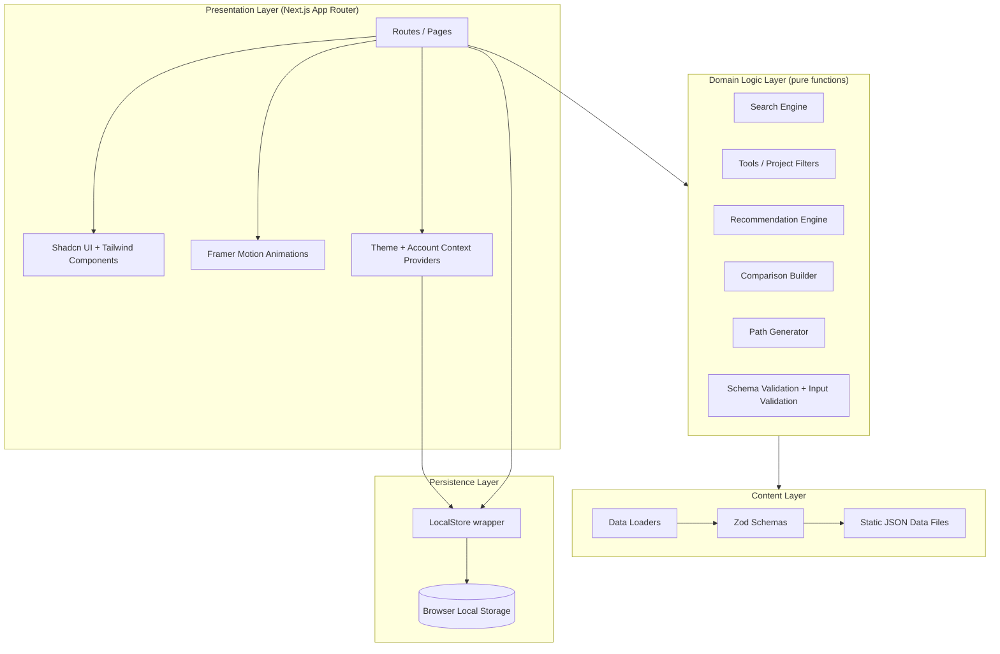
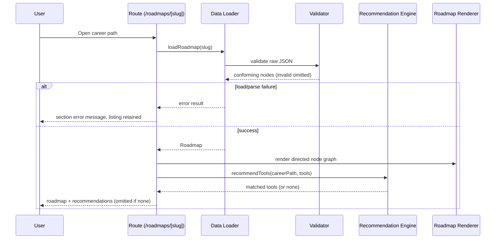
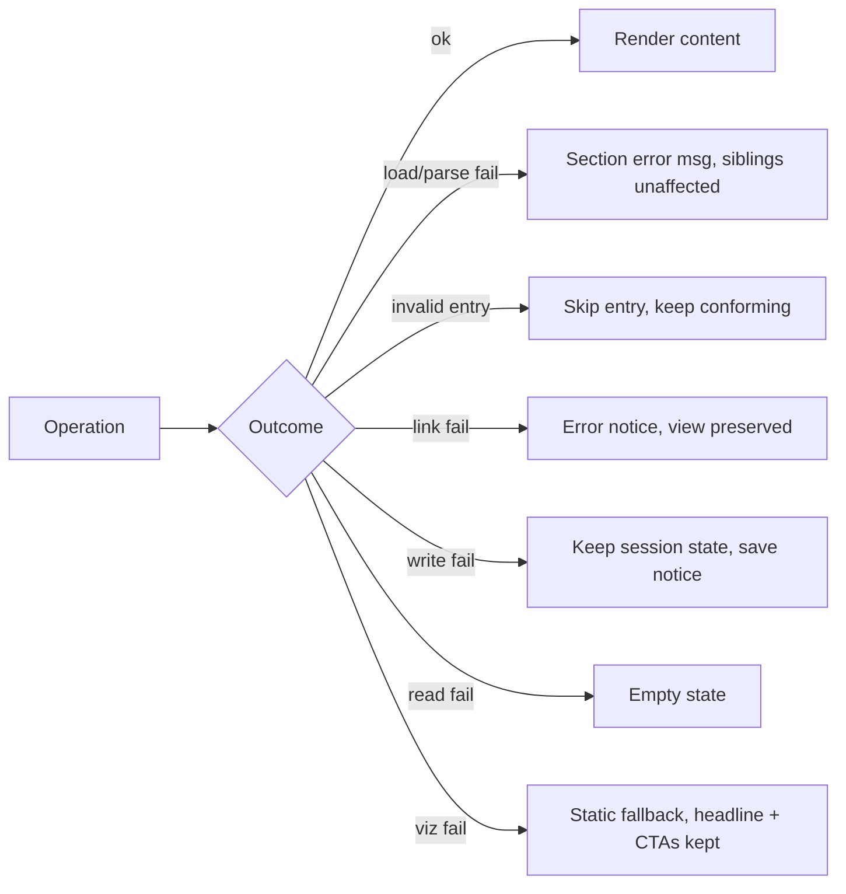

# Design Document

## Overview

DevAtlas is a client-rendered web application that unifies interactive learning roadmaps with a curated directory of free developer tools. The MVP is built with **React + TypeScript** on **Next.js (App Router)**, styled with **Tailwind CSS** and **Shadcn UI**, and animated with **Framer Motion**. There is no server-side backend or database: all domain content (career paths, roadmaps, nodes, tools, projects, learning resources) ships as **static JSON data files** bundled with the application, and all user-specific state (progress, saved items, theme) is persisted in **browser local storage**.

The design separates the application into four cooperating concerns:

1. **Content layer** — typed, validated, lazily-loaded static JSON data and the loaders/validators that turn raw files into trusted domain objects (Req 15).
2. **Domain logic layer** — pure, framework-independent functions for search indexing, filtering, recommendation matching, comparison assembly, path generation, and validation. This layer is the primary target for property-based testing.
3. **Persistence layer** — a thin, fault-tolerant wrapper around local storage for progress, saved items, and theme (Req 11, Req 12).
4. **Presentation layer** — Next.js App Router routes, Shadcn UI components, and Framer Motion animations that render the above and handle interaction quality, responsiveness, accessibility, performance, and SEO (Req 1, 2, 5, 12, 13, 14).

A guiding principle is **fault isolation**: a failure in one data file, one link, one local-storage write, or the hero animation must never take down the page. Each section degrades independently to a defined fallback (static image, error message, placeholder, empty state).

### Technology Rationale

- **Next.js App Router with SSG** gives statically generated markup for every public route, satisfying SEO and fast first paint (Req 14.1, 14.3) while keeping the app fully client-interactive after hydration.
- **Static JSON + build-time imports** means content is part of the bundle/route data, removing the need for a backend (Req 15.1, 15.2) and making "add content by editing a data file" trivial (Req 15.5).
- **Pure domain logic** isolated from React enables deterministic, high-iteration property-based testing of the algorithmically interesting behavior (search, filter, recommend, compare, generate).
- **Shadcn UI + Tailwind design tokens** provide a single design system with light/dark theming (Req 12) and accessible primitives (Req 13).

## Architecture

### High-Level Architecture



### Data Flow: Viewing a Roadmap



### Rendering & Persistence Strategy

- **Static Generation (SSG)**: `generateStaticParams` enumerates all 12 career paths, all tools, and all projects so every public route is pre-rendered to HTML at build time (Req 14.1, 14.3).
- **Hydration then interactivity**: roadmap interaction, search, filtering, and the path generator run client-side after hydration.
- **Local storage is client-only**: persistence is accessed inside effects/event handlers guarded for `typeof window !== "undefined"`, never during SSG, so account state never blocks first paint (Req 11.5).
- **No-account default**: all content routes render and function with zero local-storage data (Req 11.5). Account features layer on top.

### Project Structure

```
app/
  layout.tsx                  # root: ThemeProvider, AccountProvider, Navigation_Bar
  page.tsx                    # Homepage (Req 1)
  roadmaps/
    page.tsx                  # Career Path Catalog (Req 4)
    [slug]/page.tsx           # Interactive Roadmap (Req 5, 7)
  tools/
    page.tsx                  # Tools Library (Req 6)
    [id]/page.tsx             # Tool Card detail
  projects/
    page.tsx                  # Project Hub (Req 8)
    [id]/page.tsx             # Project detail (Req 8.6)
  learning-paths/page.tsx     # Path Generator (Req 10)
  compare/page.tsx            # Comparison View (Req 9)
  resources/page.tsx          # Resources listing
  community/page.tsx          # Community
  dashboard/page.tsx          # Account & Progress Dashboard (Req 11)
  sitemap.ts                  # Sitemap (Req 14.4)
lib/
  domain/                     # pure logic (search, filter, recommend, compare, generate, validate)
  content/                    # loaders + zod schemas
  store/                      # LocalStore persistence wrapper
  seo/                        # metadata helpers + defaults
data/                         # static JSON content files
components/                   # Shadcn UI components + feature components
```

## Components and Interfaces

### Routes / Pages (Next.js App Router)

| Route | Component | Requirements |
|-------|-----------|--------------|
| `/` | Homepage with hero, animated roadmap viz, CTAs | 1 |
| `/roadmaps` | Career Path Catalog (12 paths) | 4 |
| `/roadmaps/[slug]` | Interactive Roadmap + recommendations | 5, 7 |
| `/tools` | Tools Library with filters | 6 |
| `/tools/[id]` | Tool Card detail | 6 |
| `/projects` | Project Hub with skill-level filter | 8 |
| `/projects/[id]` | Project detail | 8 |
| `/learning-paths` | Path Generator | 10 |
| `/compare` | Comparison View | 9 |
| `/resources` | Learning resources listing | 3, 15 |
| `/community` | Community page | 2 |
| `/dashboard` | Account & Progress Dashboard | 11 |
| `/sitemap.xml` | Generated sitemap | 14 |

### Layout & Navigation Components

- **`RootLayout`** — wraps every route with `ThemeProvider`, `AccountProvider`, `Navigation_Bar`, and applies SEO defaults. Renders `lang` and skip-link for accessibility (Req 13).
- **`NavigationBar`** — sticky top bar (`position: sticky; top: 0`) with links to Roadmaps, Free Tools, Learning Paths, Projects, Resources, Compare Tools, Community; an always-visible `SearchControl`; active-link indication via `usePathname`; and a collapsible `MobileMenu` (Shadcn `Sheet`) below 768px (Req 2).
- **`SearchControl` + `SearchResults`** — opens a focused query input; calls the Search Engine; renders type-grouped results or a query-bearing no-results message (Req 3).
- **`ThemeToggle`** — switches light/dark, writes to `LocalStore`, shows a non-blocking notice on write failure (Req 12).

### Feature Components

- **`HeroRoadmapViz`** — Framer Motion animated, interactive mini node graph. Wrapped in an error boundary that renders `HeroFallbackImage` while keeping headline and CTAs intact (Req 1.2, 1.3, 1.7).
- **`RoadmapRenderer`** — renders nodes connected by directed connectors (SVG/edge layout) ordered first→last; handles node selection and renders the six sections (Req 5.1, 5.2).
- **`NodeSectionPanel`** — renders Learn/Practice/Build/Use/Deploy/Career; shows placeholders for empty sections (Req 5.9) and a loading indicator when content is not ready within 100ms (Req 5.12).
- **`ExternalLink`** — opens external sites in a new tab (`target="_blank" rel="noopener noreferrer"`); on failure shows an error message and preserves the current view (Req 5.10, 5.11, 6.4, 6.5).
- **`ToolCard`** — name, description, free-tier, category, website link, plus alternatives and tags when defined (Req 6.2).
- **`ToolFilters`** — category + tag multi-select with clear-filters control (Req 6.6–6.8).
- **`RecommendationsSection`** — renders tools matched to the career path; omitted entirely when there are no matches (Req 7).
- **`ProjectCard` / `ProjectFilters`** — single skill-level filter, clear control, no-results message (Req 8).
- **`ComparisonView`** — 2–4 tools side by side with fixed rows; add/remove with min-2/max-4 enforcement and messages (Req 9).
- **`PathGeneratorForm` + `GeneratedPathView`** — goal/time/level form with validation; renders the generated roadmap (Req 10).
- **`Dashboard`** — completed skills/roadmaps, saved tools, bookmarked resources, per-roadmap progress bars, undo/remove, empty state (Req 11).

### Context Providers

```typescript
interface ThemeContextValue {
  theme: "light" | "dark";
  setTheme: (theme: "light" | "dark") => void;
  persistenceError: boolean; // true when last write to Local_Store failed (Req 12.7)
}

interface AccountContextValue {
  account: AccountState;            // progress, saved tools, bookmarks
  hasAccount: boolean;
  markNodeCompleted: (roadmapId: string, nodeId: string) => void;
  unmarkNodeCompleted: (roadmapId: string, nodeId: string) => void;
  saveTool: (toolId: string) => void;
  removeSavedTool: (toolId: string) => void;
  bookmarkResource: (resourceId: string) => void;
  removeBookmark: (resourceId: string) => void;
  persistenceError: boolean;        // true when last write failed (Req 11.8)
  readError: boolean;               // true when initial read failed (Req 11.9)
}
```

### Domain Logic Interfaces (pure functions)

```typescript
// Search (Req 3)
function buildSearchIndex(content: ContentBundle): SearchIndex;
function search(index: SearchIndex, query: string): GroupedResults;
//   - query < 2 or > 100 chars => empty (no results shown)
//   - case-insensitive substring match on name or tags
//   - results grouped by content type

// Tools filtering (Req 6)
function filterTools(tools: Tool[], filter: ToolFilter): Tool[];
//   - filter = { categories: ToolCategory[]; tags: string[] }
//   - empty filter => all tools
//   - tool kept iff category ∈ selected categories (when any) AND tool carries EVERY selected tag

// Project filtering (Req 8)
function filterProjects(projects: Project[], level: SkillLevel | null): Project[];
//   - null => all; otherwise exactly the projects at that level

// Recommendations (Req 7)
function recommendTools(careerPath: CareerPath, tools: Tool[]): Tool[];
//   - every tool whose tags match the path's tag set; [] when none

// Comparison (Req 9)
function buildComparison(selected: Tool[]): ComparisonTable;     // assumes 2..4
function canAddTool(selectedCount: number): boolean;             // < 4
function canRemoveTool(selectedCount: number): boolean;          // > 2

// Path generation (Req 10)
function generatePath(input: PathGeneratorInput): GeneratedPath;
function validatePathInput(raw: RawPathInput): ValidationResult<PathGeneratorInput>;

// Content validation (Req 15)
function parseContent<T>(schema: ZodSchema<T>, raw: unknown[]): { valid: T[]; skipped: number };
```

## Data Models

All content is defined as static JSON validated at load time by [Zod](https://zod.dev) schemas. The TypeScript types below are the inferred, trusted domain types; each has a corresponding Zod schema used by the loader (Req 15.1, 15.4).

### Core Enumerations

```typescript
type CareerPathId =
  | "frontend" | "backend" | "fullstack" | "mobile"
  | "ai-engineer" | "ml-engineer" | "data-scientist" | "devops"
  | "cloud" | "cybersecurity" | "game-dev" | "blockchain"; // exactly 12 (Req 4.1)

type ToolCategory =
  | "AI" | "Hosting" | "Databases" | "Analytics" | "Auth" | "Storage"
  | "Monitoring" | "CI/CD" | "APIs" | "Design" | "Productivity"
  | "Testing" | "Security" | "Open Source"; // 14 categories (Req 6.1)

type SkillLevel = "Beginner" | "Intermediate" | "Advanced" | "Production-grade"; // (Req 8.1)

type ContentType =
  | "roadmap" | "node" | "technology" | "tool" | "database"
  | "api" | "hosting" | "ai-service" | "resource"; // search groups (Req 3.1)

type NodeSectionKey = "learn" | "practice" | "build" | "use" | "deploy" | "career";
```

### Career Path & Roadmap

```typescript
interface CareerPath {
  id: CareerPathId;
  name: string;            // e.g. "Frontend"
  description: string;     // <= 200 chars (Req 4.2)
  tags: string[];          // used for tool recommendation matching (Req 7)
  roadmapId: string;
}

interface Roadmap {
  id: string;
  careerPathId: CareerPathId;
  nodes: RoadmapNode[];        // ordered first -> last
  edges: RoadmapEdge[];        // directed connectors (Req 5.1)
}

interface RoadmapEdge {
  from: string;   // node id
  to: string;     // node id
}

interface RoadmapNode {
  id: string;
  title: string;          // skill/topic name
  order: number;          // sequence position
  tags: string[];
  sections: {
    learn: ResourceLink[];     // courses, docs, videos, articles (Req 5.3)
    practice: ResourceLink[];  // challenges, exercises, platforms (Req 5.4)
    build: ProjectRef[];       // project suggestions (Req 5.5)
    use: ToolRef[];            // recommended free tools (Req 5.6)
    deploy: ResourceLink[];    // deployment platforms (Req 5.7)
    career: ResourceLink[];    // interview, resume, job resources (Req 5.8)
  };
}

interface ResourceLink {
  id: string;
  name: string;
  url: string;            // external; opens in new tab (Req 5.10)
  resourceType: "course" | "documentation" | "video" | "article"
              | "challenge" | "platform" | "deployment" | "career";
  tags: string[];
}

interface ProjectRef { projectId: string; }
interface ToolRef { toolId: string; }
```

### Tool

```typescript
interface Tool {
  id: string;
  name: string;
  description: string;
  category: ToolCategory;     // (Req 6.1)
  freeTier: string;           // free-tier details
  website: string;            // external link (Req 6.2)
  alternatives?: string[];    // optional (Req 6.2)
  tags: string[];             // optional/empty allowed; drives filter + recommend (Req 6.6, 7)
  // Comparison attributes (Req 9.2); any may be absent -> placeholder shown (Req 9.3)
  comparison?: {
    databaseSupport?: string;
    authSupport?: string;
    storageSupport?: string;
    realtimeSupport?: string;
    pricing?: string;
    learningCurve?: string;
  };
}
```

### Project & Learning Resource

```typescript
interface Project {
  id: string;
  name: string;
  skillLevel: SkillLevel;          // exactly one (Req 8.1)
  description: string;             // (Req 8.2)
  requiredSkills: string[];
  estimatedTime: string;
  techStack: string[];
  learningOutcomes: string[];
  tags: string[];
}

interface LearningResource {
  id: string;
  name: string;
  url: string;
  resourceType: ResourceLink["resourceType"];
  tags: string[];
}
```

### Search, Comparison, and Path Generator Models

```typescript
interface SearchableItem {
  id: string;
  name: string;
  type: ContentType;
  tags: string[];
  href: string;        // navigation target (Req 3.5)
}

interface SearchIndex { items: SearchableItem[]; }

type GroupedResults = Partial<Record<ContentType, SearchResult[]>>;
interface SearchResult { id: string; name: string; type: ContentType; href: string; }

interface ToolFilter { categories: ToolCategory[]; tags: string[]; }

interface ComparisonRow { label: string; values: (string | null)[]; } // null -> placeholder
interface ComparisonTable { tools: Tool[]; rows: ComparisonRow[]; }

interface RawPathInput { goal: string | null; hoursPerWeek: string; skillLevel: SkillLevel | null; }
interface PathGeneratorInput { goal: CareerPathId; hoursPerWeek: number; skillLevel: SkillLevel; }

interface GeneratedPath {
  goal: CareerPathId;
  milestones: Milestone[];       // excludes levels below input (Req 10.3)
  projects: Project[];
  resources: ResourceLink[];
  tools: Tool[];
  deployment: ResourceLink[];
}
interface Milestone { nodeId: string; title: string; skillLevel: SkillLevel; }
```

### Account / Persistence Model

```typescript
interface AccountState {
  completedNodes: Record<string, string[]>;  // roadmapId -> nodeIds (Req 11.2, 11.4)
  savedToolIds: string[];                     // (Req 11.3)
  bookmarkedResourceIds: string[];            // (Req 11.3)
  schemaVersion: number;
}

// Per-roadmap progress: percent = round(completed / totalNodes * 100), clamped 0..100 (Req 11.4)
function roadmapProgress(state: AccountState, roadmap: Roadmap): number;
```

### Static JSON Data Files (Req 15)

```
data/
  career-paths.json     # exactly 12 CareerPath entries (Req 4.1)
  roadmaps/<slug>.json   # one Roadmap per path, with nodes + edges
  tools.json            # Tool[]
  projects.json         # Project[]
  resources.json        # LearningResource[]
```

Adding a conforming entry to any of these files surfaces it on next load with no other code changes (Req 15.5). Each loader validates against the matching Zod schema, skipping non-conforming entries (Req 15.4) and reporting per-file retrieve/parse failures to the calling section (Req 15.3).

## Correctness Properties

*A property is a characteristic or behavior that should hold true across all valid executions of a system — essentially, a formal statement about what the system should do. Properties serve as the bridge between human-readable specifications and machine-verifiable correctness guarantees.*

The properties below target the **pure domain logic layer** (search, filtering, recommendation, comparison, path generation, validation, progress, persistence serialization, SEO metadata, and the design-token contrast palette). UI rendering, animation timing, responsive layout, performance budgets, and infrastructure wiring are validated by example, smoke, and integration tests in the Testing Strategy rather than as properties. Each property was derived from the prework analysis and reflects the consolidations identified in the Property Reflection step.

### Property 1: Search index covers every content item

*For any* content bundle, building the search index produces exactly one searchable item for each source item, and each searchable item's content type equals the type of its source item (roadmap, node, technology, tool, database, API, hosting, AI service, or resource).

**Validates: Requirements 3.1**

### Property 2: Search returns exactly the case-insensitive substring matches

*For any* search index and *any* query, when the query length is between 2 and 100 characters the returned results are exactly those indexed items whose name or one of whose tags contains the query as a case-insensitive substring; when the query length is below 2 (or above 100) the result set is empty.

**Validates: Requirements 3.2, 3.6**

### Property 3: Search results are grouped by their own content type

*For any* set of search results, every result appears in the group keyed by that result's content type and in no other group, and no group contains a result of a different type.

**Validates: Requirements 3.3**

### Property 4: Career path catalog integrity

*For any* loaded career-path catalog, the set of path ids is exactly the twelve supported ids (frontend, backend, fullstack, mobile, ai-engineer, ml-engineer, data-scientist, devops, cloud, cybersecurity, game-dev, blockchain), no other ids are present, every path references a loadable roadmap, and every path's description is at most 200 characters.

**Validates: Requirements 4.1, 4.2**

### Property 5: Roadmap nodes are forward-ordered by their connectors

*For any* roadmap, the nodes form a strictly increasing sequence by their order field, and every directed edge connects a node of lower order to a node of higher order (no backward or self connector), so the connectors order nodes from first to last.

**Validates: Requirements 5.1**

### Property 6: Every node exposes exactly the six sections

*For any* roadmap node, the set of section keys it renders is exactly {learn, practice, build, use, deploy, career}.

**Validates: Requirements 5.2**

### Property 7: Empty sections show a placeholder, non-empty sections show items

*For any* roadmap node, each section that contains no items renders the no-content placeholder, and each section that contains at least one item renders its items rather than the placeholder.

**Validates: Requirements 5.9**

### Property 8: Every tool belongs to a supported category

*For any* loaded tool, its category is one of the fourteen supported tool categories (AI, Hosting, Databases, Analytics, Auth, Storage, Monitoring, CI/CD, APIs, Design, Productivity, Testing, Security, Open Source).

**Validates: Requirements 6.1**

### Property 9: Tool card shows required fields always and optional fields when present

*For any* tool, the rendered tool card includes its name, description, free-tier details, category, and website link, and it includes the alternatives and tags exactly when the tool defines them.

**Validates: Requirements 6.2**

### Property 10: Tool filtering applies category membership and conjunctive tag matching

*For any* list of tools and *any* filter, a tool is included in the result if and only if (its category is among the selected categories, or no category is selected) and the tool carries every selected tag; every excluded tool fails at least one of these conditions.

**Validates: Requirements 6.6**

### Property 11: No active filters yields the full tool set

*For any* list of tools, filtering with no selected categories and no selected tags returns the entire list, and clearing all filters from any filter state returns that same full list.

**Validates: Requirements 6.3, 6.8**

### Property 12: Recommendations are exactly the tag-matching tools

*For any* career path and *any* list of tools, the recommendation result contains exactly those tools that share at least one tag with the career path's tag set; when no tool shares a tag the result is empty (and the recommendations section is omitted).

**Validates: Requirements 7.1, 7.2, 7.3, 7.5**

### Property 13: Every project has exactly one supported skill level

*For any* loaded project, its skill level is exactly one of Beginner, Intermediate, Advanced, or Production-grade.

**Validates: Requirements 8.1**

### Property 14: Project detail shows all required fields

*For any* project, the rendered project detail includes its description, required skills, estimated completion time, recommended technology stack, and learning outcomes.

**Validates: Requirements 8.2**

### Property 15: Project filtering selects exactly the chosen level

*For any* list of projects, filtering with no level selected returns all projects, and filtering by a given skill level returns exactly the projects classified at that level and excludes every project at any other level.

**Validates: Requirements 8.3, 8.4**

### Property 16: Comparison builds one column per selected tool with the fixed rows

*For any* selection of two to four tools, the comparison table has one column per selected tool in selection order and its rows are exactly the fixed set: free-tier details, database support, authentication support, storage support, realtime support, pricing, and learning curve.

**Validates: Requirements 9.1, 9.2**

### Property 17: Missing comparison values render as a placeholder

*For any* selection of tools, each comparison cell whose underlying attribute is absent renders the unavailable-value placeholder, and each cell whose attribute is present renders that attribute's value.

**Validates: Requirements 9.3**

### Property 18: Comparison selection size is bounded between 2 and 4

*For any* current selection size, adding a tool is permitted only when fewer than four are selected and removing a tool is permitted only when more than two are selected; a permitted removal yields a selection that excludes the removed tool with size reduced by one.

**Validates: Requirements 9.4, 9.5, 9.6**

### Property 19: Generated path contains all required components

*For any* valid path-generator input (goal, whole-number hours per week in 1–80, skill level), the generated path provides milestones, recommended projects, learning resources, recommended tools, and deployment recommendations.

**Validates: Requirements 10.2**

### Property 20: Generated milestones never fall below the chosen skill level

*For any* valid path-generator input, every milestone in the generated path has a skill level greater than or equal to the input skill level, under the ordering Beginner < Intermediate < Advanced < Production-grade.

**Validates: Requirements 10.3**

### Property 21: Path input validation accepts only well-formed input

*For any* raw path-generator input, validation succeeds if and only if a goal is selected, a skill level is selected, and the available time is a whole number between 1 and 80 inclusive; when it fails, the result identifies the offending field (missing goal, missing skill level, or invalid time range).

**Validates: Requirements 10.4, 10.5, 10.6**

### Property 22: Roadmap progress is a clamped percentage of completed nodes

*For any* roadmap and *any* subset of its nodes marked completed, the computed progress equals round(completed / total × 100), always lies between 0 and 100 inclusive, equals 0 when no nodes are completed, and equals 100 when all nodes are completed.

**Validates: Requirements 11.4**

### Property 23: Account state survives a persist/restore round trip

*For any* account state (completed nodes, saved tools, bookmarked resources), serializing it to the local store and then restoring it yields an account state equal to the original.

**Validates: Requirements 11.2, 11.3, 11.6**

### Property 24: Add-then-remove returns to the prior state

*For any* account state and *any* item (completed node, saved tool, or bookmarked resource), adding the item and then removing it produces a state equal to the original, and removing an item that is present deletes exactly that item and leaves all others unchanged.

**Validates: Requirements 11.7**

### Property 25: Theme persistence round trip and default resolution

*For any* theme selection, storing it and then resolving the theme returns the same theme; and when no theme is stored, the resolved theme is light.

**Validates: Requirements 12.1, 12.3, 12.6**

### Property 26: Design-token text/background pairs meet contrast thresholds

*For any* defined text-on-background design-token pair, the computed contrast ratio is at least 4.5:1 for small text and at least 3:1 for large or bold text, in both the light and dark palettes.

**Validates: Requirements 13.4, 13.5**

### Property 27: Every route exposes valid, unique SEO metadata

*For any* public route, the resolved metadata has a title of length 1–60 and a meta description of length 50–160 (applying the defaults when a route defines neither), and the resolved titles across all public routes are unique.

**Validates: Requirements 14.2, 14.5**

### Property 28: Sitemap lists exactly the public routes

*For any* route registry, the generated sitemap contains every public route and contains no non-public route.

**Validates: Requirements 14.4**

### Property 29: Content validation keeps conforming entries and omits the rest

*For any* array of raw data entries, parsing against the content schema returns exactly the entries that conform to the schema, omits every non-conforming entry, reports a skipped count equal to the number of non-conforming entries, and includes any newly added conforming entry in its output.

**Validates: Requirements 15.4, 15.5**

## Error Handling

The system follows a **fault-isolation** strategy: each independently loadable section, link action, and storage operation has a defined degraded state so that one failure never blocks the rest of the page (Req 15.3).

### Content Loading Errors

- **File retrieve/parse failure** (Req 4.4, 6.9, 15.3): each loader returns a discriminated result `{ ok: true, data } | { ok: false, error }`. The owning section renders a section-scoped error message identifying the affected area while sibling sections continue to render their already-loaded content. The roadmaps listing in particular stays interactive with all other paths selectable when one roadmap fails (Req 4.4).
- **Schema-invalid entries** (Req 15.4): `parseContent` validates each entry independently with Zod; non-conforming entries are skipped (and counted) while conforming entries flow through. Invalid entries never throw past the loader.

### Link Errors

- **External link open failure** (Req 5.11, 6.5): `ExternalLink` attempts to open the target in a new tab; if opening fails (blocked/exception), it surfaces a non-blocking error message ("link could not be opened") and preserves the current view (roadmap node view or tools library) unchanged.

### Persistence Errors

- **Write failure** (Req 11.8, 12.7): the `LocalStore` wrapper catches exceptions from `setItem` (e.g., quota or disabled storage). On failure it keeps the in-memory session state intact and sets a `persistenceError` flag that the UI surfaces as a "could not be saved" notice; for theme, the selected theme still applies for the session.
- **Read failure** (Req 11.9): on startup the wrapper catches read/parse exceptions and corrupt data, returning a clean empty state so the Dashboard shows its empty state rather than crashing.

### Hero Visualization Failure

- **Viz load/render failure** (Req 1.7): `HeroRoadmapViz` is wrapped in a React error boundary that renders `HeroFallbackImage` while the headline and both CTAs remain rendered by the surrounding hero layout.

### Input Validation Errors

- **Path generator** (Req 10.4–10.6): `validatePathInput` returns field-specific messages for missing goal, missing skill level, and out-of-range/non-integer time, and generation is withheld until the input is valid.

### Error Handling Patterns Summary



## Testing Strategy

The strategy is **dual**: property-based tests verify the universal correctness properties across many generated inputs, while example, edge-case, integration, and smoke tests cover concrete behaviors, UI interactions, infrastructure, and performance that are not amenable to property-based testing.

### Property-Based Testing

- **Library**: [fast-check](https://github.com/dubzzz/fast-check) with the project test runner (Vitest or Jest). Property-based testing is not implemented from scratch.
- **Scope**: the 29 correctness properties above, all targeting the pure domain logic layer (`lib/domain`, `lib/content`, `lib/store` serialization, `lib/seo`, and the design-token palette).
- **Iterations**: each property test runs a minimum of 100 generated cases.
- **Generators**: custom fast-check arbitraries for `ContentBundle`, `SearchIndex`, `Tool`, `ToolFilter`, `CareerPath`, `Roadmap`/`RoadmapNode` (with edges), `Project`, `RawPathInput`, `AccountState`, route-metadata registries, and raw-entry arrays mixing conforming and non-conforming records. Generators deliberately include edge inputs (empty collections, whitespace/unicode strings, query lengths 0/1/2/100/101, boundary times 0/1/80/81, fractional times, selections of size 1/2/4/5, fully-empty and fully-complete node sets).
- **Tagging**: each property test is tagged with a comment in the format **Feature: devatlas, Property {number}: {property_text}** and references the design property it validates.

Mapping of property tests to the properties above: Properties 1–3 (search), 4–5 (catalog/roadmap integrity), 6–7 (node sections), 8–11 (tools + filtering), 12 (recommendations), 13–15 (projects), 16–18 (comparison), 19–21 (path generation), 22–24 (progress + persistence), 25 (theme), 26 (contrast), 27–28 (SEO/sitemap), 29 (content validation).

### Unit / Example Tests

Concrete behaviors and rendering specifics:
- Homepage headline, CTA labels, and CTA navigation targets (Req 1.1, 1.4, 1.5, 1.6); hero fallback on forced viz error (Req 1.7).
- Navigation link set, search-control presence, active-link indication, search-open focus, and mobile collapse/toggle behavior (Req 2).
- Node section rendering as activatable links for Learn/Practice/Deploy/Career, Build projects, and Use tools (Req 5.3–5.8); external links use `target="_blank" rel="noopener noreferrer"` (Req 5.10); link-failure and slow-content loading states (Req 5.11, 5.12).
- No-results messages and clear controls for tools and projects (Req 6.7, 8.5); search no-results message contains the submitted query (Req 3.7); result name + type display and result navigation (Req 3.4, 3.5).
- Comparison max/min messages at the boundaries (Req 9.5, 9.6); project detail navigation from a Build section (Req 8.6); recommendation card navigation (Req 7.4).
- Path generator form structure (Req 10.1); dashboard sections and no-account access (Req 11.1, 11.5); theme toggle and dark palette application (Req 12.2, 12.4, 12.5); accessibility focus indicators, text alternatives, and keyboard operability (Req 13.2, 13.3, 13.6).

### Integration Tests

- Loaders read the bundled static JSON files and produce validated domain objects (Req 15.1).
- Forced single-file failure: the affected section shows its error while sibling sections still render (Req 15.3).
- Persistence write-failure and read-failure paths using a mocked failing/corrupt local storage (Req 11.8, 11.9, 12.7).

### Smoke / Non-Functional Tests

- No backend/network calls are made for Req 1–11 content (Req 15.2).
- SSG prerender check: every public route emits static markup (Req 14.3).
- Performance budget: primary content renders within 2.5s on a ≥5 Mbps profile, and the hero animation begins within 100ms — validated with Lighthouse/performance traces on representative routes (Req 1.2, 1.3, 12.4, 14.1).
- Responsive layout: no horizontal scrolling of primary content at 320px and 1920px boundaries (Req 13.1).
